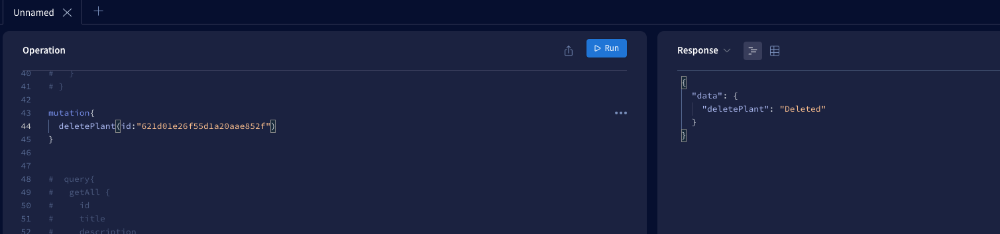

## Overview
Plants is a full stack application using REACT and Apollo in the frontend; GraphQL, Express, and MongoDB in the backend.

## Technologies
Backend: GraphQL, Apollo 
Database: MongoDB 
CRUD Route Model: Plants br/>
Frontend Framework: React 

## Backend
 Github: https://github.com/aip956/GQL_React_Plants_BE 
 Backend language: Express 4.17.2 
 Apollo Server: 3.6.3 
 GraphQL: 16.3.0 
 Database: MongoDB 
 Model: Plant 
 Run: nodemon

## Frontend
github: https://github.com/aip956/gqlplantsfe 
Apollo Client: 3.5.9
React: 17.0.2
Run: npm start

## Screenshots
### GraphQL Playground and Frontend
### Get All

### Create

### Update

### Delete

### Frontend
